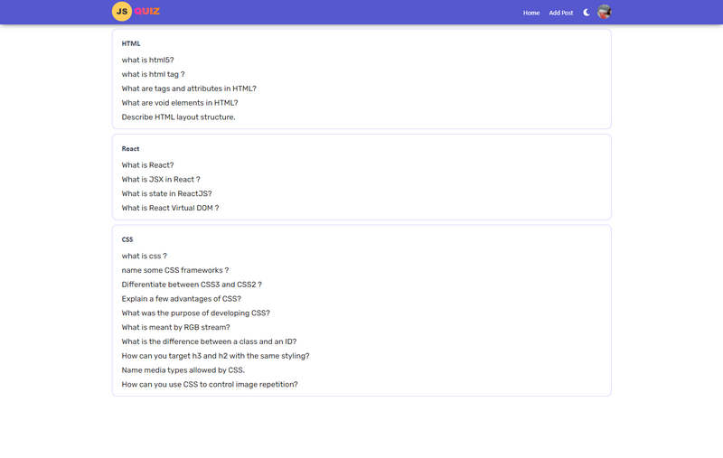
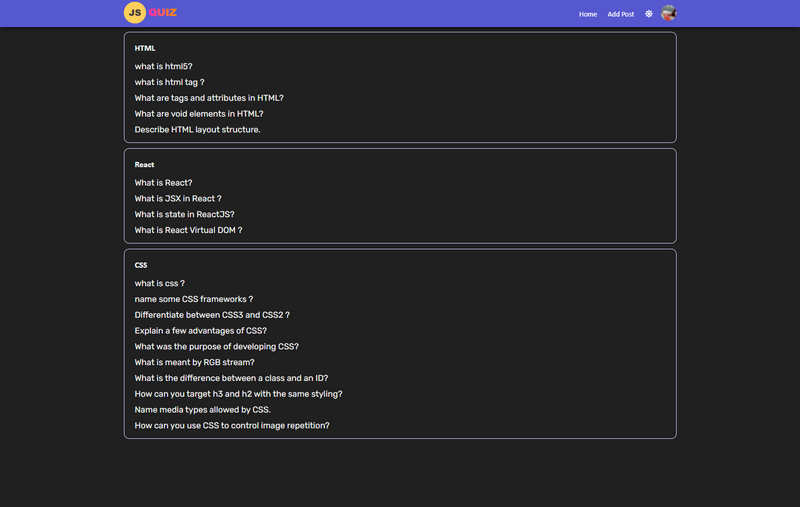
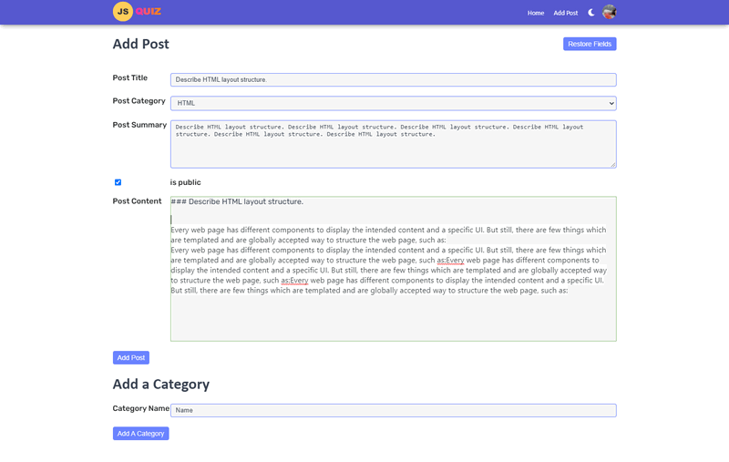
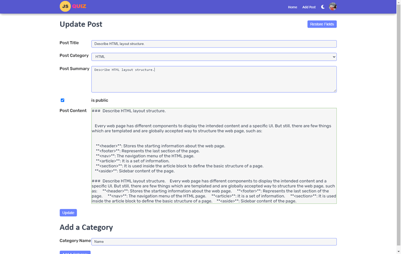
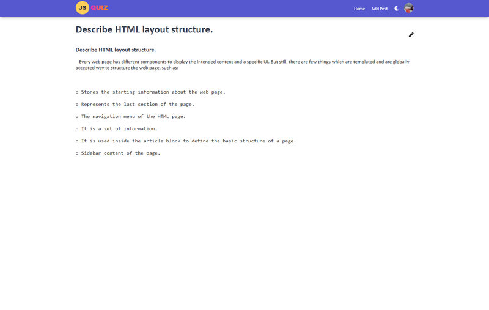
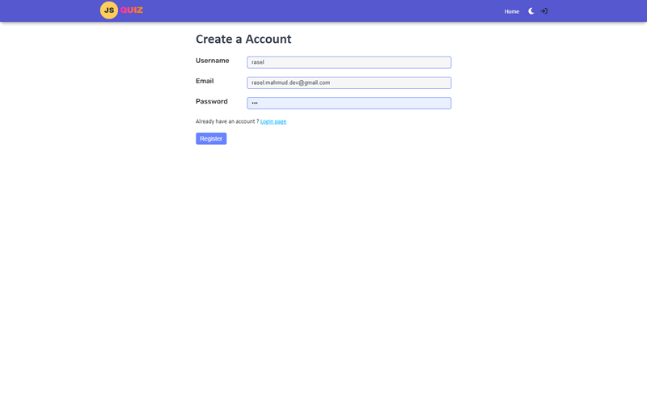

## Interview-Docs  (Preact Application)

This website for basic interview question for front-end javascript developer.

## Build website these tools
- Preact
- Nodejs
- Typescript
- ExpressJS
- Mongodb (Mongoose ORM)
- SCSS
- Esbuild for bundler

## Features
-  Lazy Loading
- Code-Splitting
- Fast-Loading
- * main client bundler.js only (around 15kb)

 

## There are three branch
- ###  with-cassandra
implement cassandra db as  SQL Database

- ###  with-mongodb
implement mongodb as a NoSQL Database

### Link link on Netlify
[https://interview-docs.netlify.app](https://interview-docs.netlify.app)

Homepage for all category and posts

## Homepage dark mode

## ADD POST page 
it support markdown text format
## ADD POST page

## Update post
it support markdown text format

## Post details

## Post Registration Page

